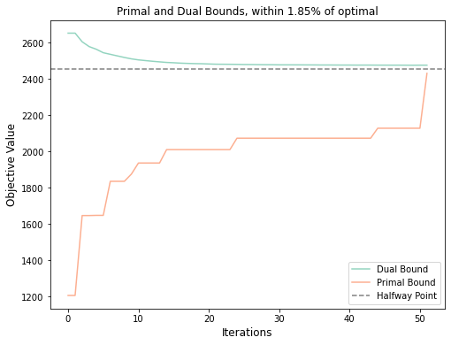
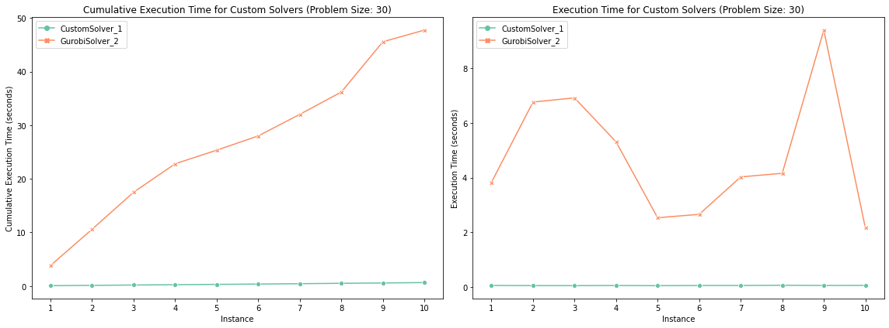

# 3D Assignment Problem

This repository provides a Python implementation of a dual-primal method for solving the 3D assignment problem.

## Functionality

The solver applies a Lagrangian relaxation technique to relax the 3D assignment problem to a 2D assignment problem, providing dual bounds. We use a modified subgradient method with Polyak step sizes and Nesterov acceleration to obtain tight dual bounds. We then reconstruct a locally optimal solution using a local search method inspired from 2-OPT. The Jupyter notebooks in this repository demonstrate additional functionality and usage examples.

### Usage
If we just want a solution using the default parameters, we can use the following code on a specified cost matrix C: 
```python
solver = Solver()
_, _, best_sol, best_value = solver.optimize(C) 
```

We can also set parameters for the solver; the ones displayed below are the defaults, and were found to give good performance across many problem sizes and instances. 
```python
learning_rate_scale="1/k"
algorithm="nesterov"
beta=0.95
search_size=10
learning_rate=0.1
max_iterations=100
threshold=0.05

solver = Solver(learning_rate_scale, algorithm, beta, search_size, learning_rate, max_iterations, threshold) # all are optional 
dual_bounds, primal_bounds, best_sol, best_value = solver.optimize(C) 
```

### Subgradient Method
The following subgradient method for the Lagrange multipliers gave the strongest results.
We use a modified Polyak step size with Nesterov acceleration.

$$x^{k+1} = x^k - \alpha_k \partial f(x^k + \beta(x^k - x^{k-1})) + \beta(x^k - x^{k-1})
$$
where $$\alpha_k = \frac{\lambda((\text{dual value})_k - (\text{best value}))}{k\|\partial f(x^k + \beta(x^k - x^{k-1})\|_2^2}$$
where we took the parameter $\beta = 0.95$
and $\lambda$ is a hyperparameter which was found to give good results with $\lambda = 0.1$.


### Local Search
We implement a local search algorithm inspired from the 2-opt algorithm for TSP which finds very good primal solutions.  This method adds very little overhead to the solution. 
Empirically we have found that the local search give slightly better solutions for very large problems as compared to small or medium problems (often < 1% for large, and between 3-5% for small/medium).
Below we display the convergence of the dual and primal bounds for a medium sized problem.




## Solver Speed Benchmarking
We are able to solve even very large problems with up to $500 \times 500 \times 500$ cost matrices to high accuracy within a few minutes:

```
Primal: 49248.00 <= Value: 49248.00 <= Dual: 49504.81, duality %: 0.52 feasible: True

366.614 <module>  speed_benchmark.py:1
├─ 260.683 Solver.optimize  main_optimized.py:586
│  └─ 260.682 Solver.nesterov_accelerated_gradient  main_optimized.py:133
│     ├─ 212.489 Solver.objective_func  main_optimized.py:62
│     │  ├─ 182.561 [self]  main_optimized.py
│     │  └─ 27.455 argmax  numpy/core/fromnumeric.py:1140
│     │        [3 frames hidden]  numpy, <built-in>
│     ├─ 33.842 Solver.local_process  main_optimized.py:256
│     │  ├─ 10.019 swap_I  main_optimized.py:257
│     │  ├─ 8.900 swap_J  main_optimized.py:345
│     │  ├─ 8.504 swap_K  main_optimized.py:428
│     │  └─ 5.856 [self]  main_optimized.py
│     └─ 13.827 [self]  main_optimized.py
├─ 97.895 duality_visualizer  utils.py:109
│  └─ 97.331 show  matplotlib/pyplot.py:323
│        [6 frames hidden]  matplotlib, <built-in>
│           97.301 mainloop  matplotlib/backends/backend_macosx.py:129
│           ├─ 80.694 [self]  matplotlib/backends/backend_macosx.py
└─ 5.118 <module>  utils.py:1
```
We can see that the local search method is quite fast, and most of the time is spent on evaluating the objective function. 

## Solver Comparison

- The solver has been benchmarked against Gurobi and PuLP. Across various problem sizes and instances, our solver consistently demonstrates a significant speed-up.
- The solver halts within 50 iterations or when it approaches within 5% of optimal.
- For the tests, cost matrix entries are uniformly chosen from the range [0, 100], and all solvers run on the same problems for a given benchmarking instance.

A benchmarking utility is provided to facilitate easy comparison between different solvers. Here is an example:
```python
N = 30
num_problems = 10

solver1 = Solver(max_iterations=50, threshold=0.05, verbosity = False)
solver2 = GurobiSolver('/Users/jetchung/gurobi.json')

solvers = [solver1, solver2]
problems = create_problems(N, num_problems, verbosity = True)

df = benchmark(problems, solvers, verbosity = True)
```

```

--------------------------------------------------
Created 10 problem instances for size 30 with scale=100.
Using a uniform distribution (beta = (1, 1)).
--------------------------------------------------


--------------------------------------------------
Benchmarking CustomSolver_1 Solver:
--------------------------------------------------
Instance 1: Objective Value: 2895.00, Duality % Gap: 2.83%
Instance 2: Objective Value: 2913.00, Duality % Gap: 2.11%
Instance 3: Objective Value: 2877.00, Duality % Gap: 3.45%
Instance 4: Objective Value: 2901.00, Duality % Gap: 2.60%
Instance 5: Objective Value: 2888.00, Duality % Gap: 3.13%
Instance 6: Objective Value: 2910.00, Duality % Gap: 2.24%
Instance 7: Objective Value: 2911.00, Duality % Gap: 2.25%
Instance 8: Objective Value: 2902.00, Duality % Gap: 2.49%
Instance 9: Objective Value: 2930.00, Duality % Gap: 1.67%
Instance 10: Objective Value: 2902.00, Duality % Gap: 2.48%
--------------------------------------------------
Avg. execution time for CustomSolver_1: 0.0640 seconds
Percentage of time fraction < 5.00%: 100.00%
--------------------------------------------------


--------------------------------------------------
Benchmarking GurobiSolver_2 Solver:
--------------------------------------------------
Instance 1: Objective Value: 2970.00
Instance 2: Objective Value: 2970.00
Instance 3: Objective Value: 2970.00
Instance 4: Objective Value: 2970.00
Instance 5: Objective Value: 2970.00
Instance 6: Objective Value: 2970.00
Instance 7: Objective Value: 2970.00
Instance 8: Objective Value: 2970.00
Instance 9: Objective Value: 2970.00
Instance 10: Objective Value: 2970.00
--------------------------------------------------
Avg. execution time for GurobiSolver_2: 4.7734 seconds
--------------------------------------------------
```


