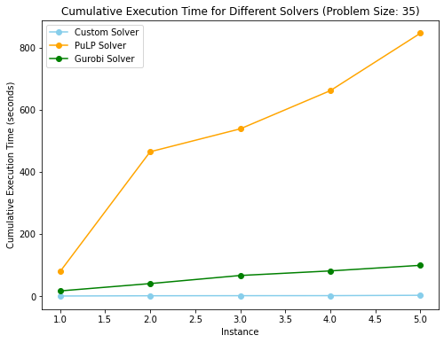
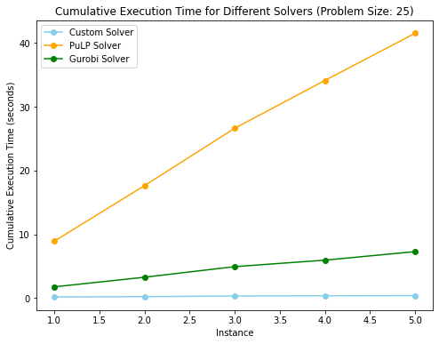
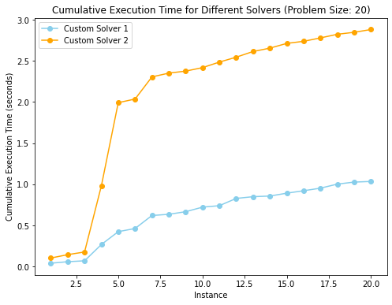

# 3D Assignment Problem

We use a dual primal method for the 3D assignment problem.

## Functionality

 We apply a Lagrangian relaxation to relax the problem to a 2D assignment problem which provides dual bounds, then reconstruct primal bounds. We then use a modified subgradient method with Polyak step sizes and Nesterov acceleration, which was shown to give strong results as compared to commercial solvers.  


### Solver Comparison

- We benchmarked our solver against Gurobi and PuLP: across many problem sizes and instances, our solver is shown to give a highly significant speed-up. 
- We halt our solver within 1000 iterations or when we are within 5% of optimal. 

Large Size Problem: Size 35
```
Created 5 problem instances for size 35.
----------
Benchmarking Custom Solver:
Objective Value: 3359.66, Duality % Gap: 3.98%
Objective Value: 3334.68, Duality % Gap: 4.76%
Objective Value: 3377.99, Duality % Gap: 3.44%
Objective Value: 3346.59, Duality % Gap: 4.41%
Objective Value: 3229.39, Duality % Gap: 8.20%
Avg. execution time for Custom Solver: 0.4742 seconds
Percentage of time fraction < 5.00%: 80.00%
----------
Benchmarking Gurobi Solver:
Objective Value: 3491.35
Objective Value: 3491.90
Objective Value: 3492.49
Objective Value: 3492.37
Objective Value: 3492.92
Avg. execution time for Gurobi Solver: 19.7722 seconds
----------
Benchmarking PuLP Solver:
Objective Value: 3491.35
Objective Value: 3491.97
Objective Value: 3492.59
Objective Value: 3492.44
Objective Value: 3492.92
Avg. execution time for PuLP Solver: 169.1876 seconds
```


Medium Size Problem: Size 20




### Subgradient Method
The following subgradient method for the Lagrange multipliers gave the strongest results.
We use a modified Polyak step size with Nesterov acceleration.

$$x^{k+1} = x^k - \alpha_k \partial f(x^k + \beta(x^k - x^{k-1})) + \beta(x^k - x^{k-1})
$$
where $$\alpha_k = \frac{\lambda((\text{dual value})_k - (\text{best value}))}{k\|\partial f(x^k + \beta(x^k - x^{k-1})\|_2^2}$$
where we took the parameter $\beta = 0.95$
and $\lambda$ is a hyperparameter which was found to give good results with $\lambda = 0.1$.
### Parameter Comparison

The following parameters were found to give good performance across many problem sizes and instances.

```
learning_rate_scale_1="1/k"
algorithm_1="nesterov"
beta_1=0.95
search_size_1=10
learning_rate_1=0.1
max_iterations_1=1000
threshold_1=0.05
```
Here we display comparison of our solver with parameter values

```
learning_rate_scale_1="1/k"
algorithm_1="nesterov"
beta_1=0.95
search_size_1=10
learning_rate_1=0.1
max_iterations_1=1000
threshold_1=0.05


learning_rate_scale_2="constant"
algorithm_2="subgradient"
beta_2=0
search_size_2=10
learning_rate_2=0.1
max_iterations_2=1000
threshold_2=0.05
```

