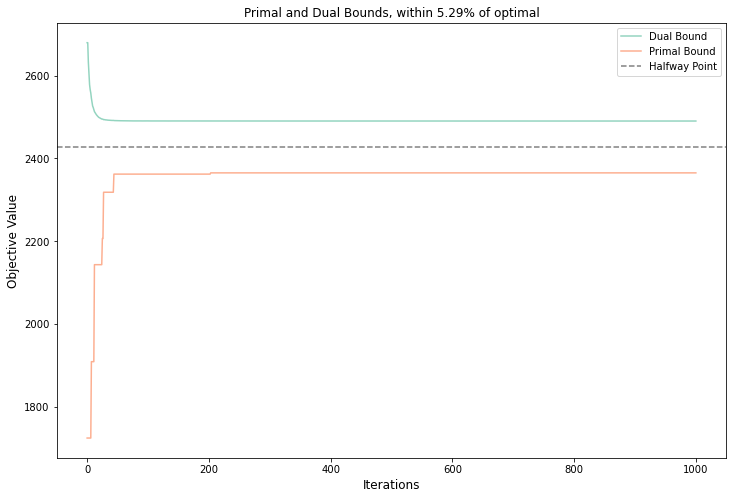
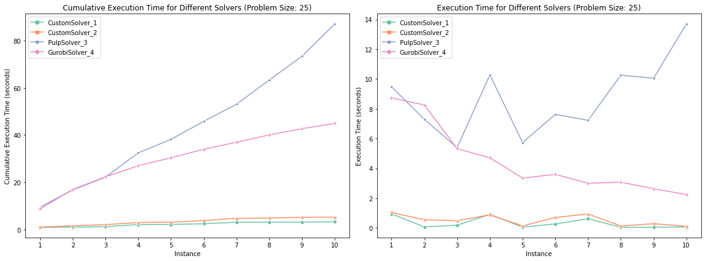
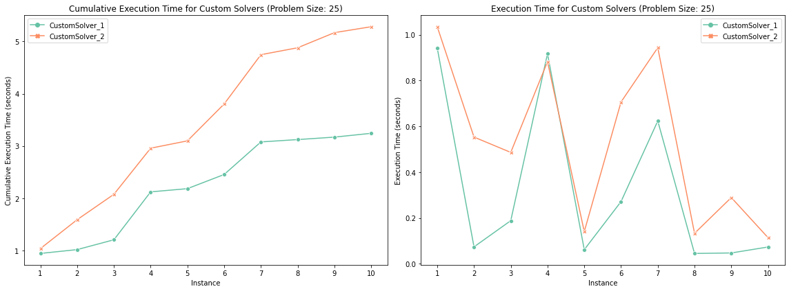

# 3D Assignment Problem

This repository provides a Python implementation of a dual-primal method for solving the 3D assignment problem.

## Functionality

The solver applies a Lagrangian relaxation technique to relax the 3D assignment problem to a 2D assignment problem, providing dual bounds. It then reconstructs primal bounds using a modified subgradient method with Polyak step sizes and Nesterov acceleration. The Jupyter notebooks in this repository demonstrate additional functionality and usage examples.

## Usage

```python
solver = Solver(learning_rate_scale="1/k", algorithm="nesterov", beta=0.95, search_size=10, learning_rate=0.1, max_iterations=1000, threshold=0.05) # all parameters are optional and the displayed parameters are the defaults
dual_bounds, primal_bounds, best_sol, best_value, delta, fraction = solver.optimize(C) # C is a given cost matrix
```

### Primal-Dual


### Solver Comparison

- The solver has been benchmarked against Gurobi and PuLP. Across various problem sizes and instances, our solver consistently demonstrates a significant speed-up.
- The solver halts within 1000 iterations or when it approaches within 5% of optimal.
- For the tests, cost matrix entries are uniformly chosen from the range [0, 100], and all solvers run on the same problems for a given benchmarking instance.

A benchmarking utility is provided to facilitate easy comparison between different solvers. Here is an example:
```python
N = 25
num_problems = 10

solver1 = Solver(learning_rate_scale="1/k", algorithm="nesterov", beta=0.95, search_size=10, learning_rate=0.1, max_iterations=1000, threshold=0.05)
solver2 = Solver(learning_rate_scale="constant", algorithm="subgradient", beta=0, search_size=10, learning_rate=0.1, max_iterations=1000, threshold=0.05)
solver3 = PulpSolver()
solver4 = GurobiSolver()

solvers = [solver1, solver2, solver3, solver4]
problems = create_problems(N, num_problems, verbosity = True)

df = benchmark(problems, solvers, verbosity = True)
```

```
--------------------------------------------------
Created 10 problem instances for size 25 with scale=100.
Using a uniform distribution (beta = (1, 1)).
--------------------------------------------------


--------------------------------------------------
Benchmarking CustomSolver_1 Solver:
--------------------------------------------------
Instance 1: Objective Value: 2374.34, Duality % Gap: 4.89%
Instance 2: Objective Value: 2385.58, Duality % Gap: 4.48%
Instance 3: Objective Value: 2404.48, Duality % Gap: 3.54%
Instance 4: Objective Value: 2350.59, Duality % Gap: 5.90%
Instance 5: Objective Value: 2388.74, Duality % Gap: 4.26%
Instance 6: Objective Value: 2381.01, Duality % Gap: 4.58%
Instance 7: Objective Value: 2412.95, Duality % Gap: 3.26%
Instance 8: Objective Value: 2382.74, Duality % Gap: 4.63%
Instance 9: Objective Value: 2406.09, Duality % Gap: 3.54%
Instance 10: Objective Value: 2409.09, Duality % Gap: 3.41%
--------------------------------------------------
Avg. execution time for CustomSolver_1: 0.3243 seconds
Percentage of time fraction < 5.00%: 90.00%
--------------------------------------------------


--------------------------------------------------
Benchmarking CustomSolver_2 Solver:
--------------------------------------------------
Instance 1: Objective Value: 2354.07, Duality % Gap: 5.83%
Instance 2: Objective Value: 2387.98, Duality % Gap: 4.40%
Instance 3: Objective Value: 2404.48, Duality % Gap: 3.55%
Instance 4: Objective Value: 2337.77, Duality % Gap: 6.51%
Instance 5: Objective Value: 2388.34, Duality % Gap: 4.26%
Instance 6: Objective Value: 2387.40, Duality % Gap: 4.33%
Instance 7: Objective Value: 2347.97, Duality % Gap: 6.16%
Instance 8: Objective Value: 2397.13, Duality % Gap: 4.02%
Instance 9: Objective Value: 2380.79, Duality % Gap: 4.65%
Instance 10: Objective Value: 2442.47, Duality % Gap: 1.99%
--------------------------------------------------
Avg. execution time for CustomSolver_2: 0.5283 seconds
Percentage of time fraction < 5.00%: 70.00%
--------------------------------------------------


--------------------------------------------------
Benchmarking PulpSolver_3 Solver:
--------------------------------------------------
Instance 1: Objective Value: 2488.54
Instance 2: Objective Value: 2490.63
Instance 3: Objective Value: 2488.17
Instance 4: Objective Value: 2487.37
Instance 5: Objective Value: 2487.77
Instance 6: Objective Value: 2488.48
Instance 7: Objective Value: 2489.48
Instance 8: Objective Value: 2490.87
Instance 9: Objective Value: 2488.72
Instance 10: Objective Value: 2488.73
--------------------------------------------------
Avg. execution time for PulpSolver_3: 8.7062 seconds
--------------------------------------------------


--------------------------------------------------
Benchmarking GurobiSolver_4 Solver:
--------------------------------------------------
Instance 1: Objective Value: 2488.54
Instance 2: Objective Value: 2490.63
Instance 3: Objective Value: 2488.08
Instance 4: Objective Value: 2487.37
Instance 5: Objective Value: 2487.77
Instance 6: Objective Value: 2488.48
Instance 7: Objective Value: 2489.48
Instance 8: Objective Value: 2490.87
Instance 9: Objective Value: 2488.72
Instance 10: Objective Value: 2488.73
--------------------------------------------------
Avg. execution time for GurobiSolver_4: 4.4943 seconds
--------------------------------------------------
```






### Subgradient Method
The following subgradient method for the Lagrange multipliers gave the strongest results.
We use a modified Polyak step size with Nesterov acceleration.

$$x^{k+1} = x^k - \alpha_k \partial f(x^k + \beta(x^k - x^{k-1})) + \beta(x^k - x^{k-1})
$$
where $$\alpha_k = \frac{\lambda((\text{dual value})_k - (\text{best value}))}{k\|\partial f(x^k + \beta(x^k - x^{k-1})\|_2^2}$$
where we took the parameter $\beta = 0.95$
and $\lambda$ is a hyperparameter which was found to give good results with $\lambda = 0.1$.
### Parameter Comparison

The following parameters were found to give good performance across many problem sizes and instances.

```
learning_rate_scale="1/k"
algorithm="nesterov"
beta=0.95
search_size=10
learning_rate=0.1
max_iterations=1000
threshold=0.05
```
